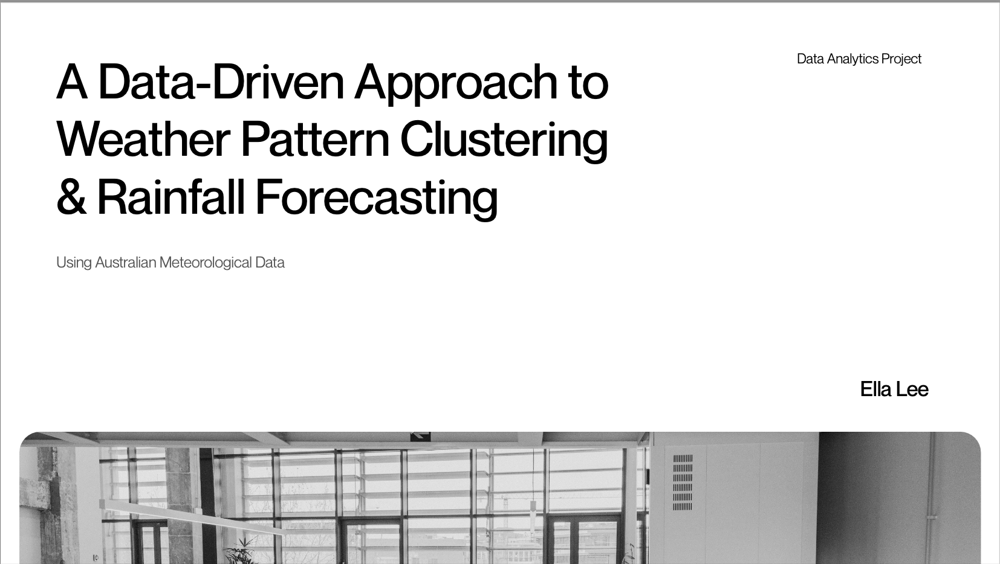
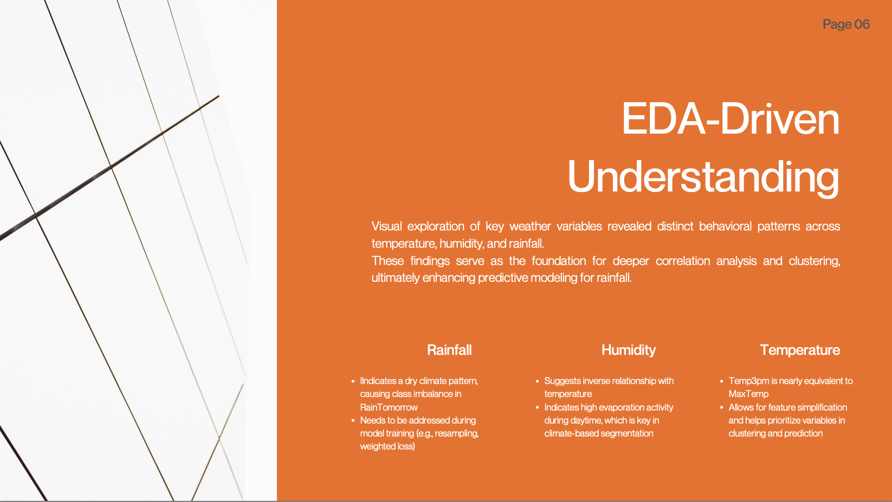
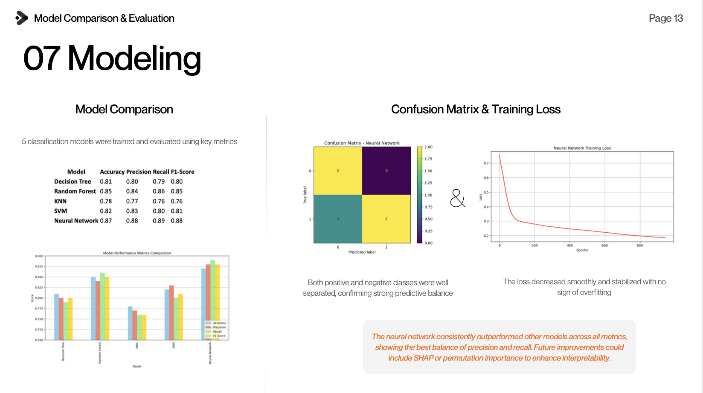

# 🌦️ Weather Data Analytics & Rainfall Prediction

> A full-cycle weather analytics project performing **EDA**, **clustering**, and **rainfall prediction** using machine learning models.  
> Focused on extracting actionable insights from real-world weather data to support forecasting and decision-making.

---

  

---

## 📊 Project Overview

This project analyzes Australian weather data to explore statistical patterns, discover latent weather clusters, and predict rainfall using various machine learning models.  
It simulates a professional data science workflow from raw data analysis to trained model delivery.

---

## 🎯 Objectives

- Perform structured EDA and pattern analysis  
- Engineer features for improved model learning  
- Apply **KMeans clustering** for weather condition discovery  
- Develop classifiers to predict **RainTomorrow (Yes/No)**  
- Compare models and select the best-performing model  
- Generate insights applicable to **agriculture, energy, and weather forecasting**

---

## 📂 Repository Structure

| Folder / File                 | Description                                          |
|-------------------------------|------------------------------------------------------|
| `notebooks/`                  | Main analysis notebooks (`01`, `02`)                 |
| `scripts/`                    | Python modules for reusable data processing code     |
| `models/`                     | Final trained ML model (`.pkl` file)                 |
| `figures/`                    | Visual outputs (EDA, clustering, modeling)           |
| `reports/`                    | PDF project reports summarizing analysis steps       |
| `requirements.txt`            | Python dependencies                                  |
| `README.md`                   | This project overview                                |

📄 **[Click here to view the final PDF report](reports/Weather_Analytics_Final_Report_Ella_Lee.pdf)**  
(A presentation-style summary of the entire project)

---

## 🧩 Dataset Description

- **Source:** Australian Bureau of Meteorology (BOM)  
- **Period:** March 2008 – June 2017  
- **Total Records:** 1,769 daily observations  
- **Target Variable:** `RainTomorrow` (Yes/No)  
- **Features Include:** Temperatures, wind speeds, humidity, rainfall, pressure, cloud cover, derived ratios

---

## 🔍 Analysis & Modeling Workflow

### 🧪 01. Exploratory Analysis & Weather Pattern Clustering

- Missing value handling via median/mode imputation  
- Feature engineering (binning, scaling, binarization, discretization)  
- Correlation analysis to identify predictive features  
- **KMeans clustering** to discover meaningful weather groupings

📄 Notebook: `01_eda_clustering.ipynb`  
📄 Report: `reports/01_eda_clustering.pdf`

  

---

### ☔️ 02. Rainfall Prediction Modeling

- ML models tested:
  - Decision Tree, KNN, Random Forest, SVM, **Neural Network**
- Metrics: Accuracy, Precision, Recall, F1-score  
- Hyperparameter tuning via GridSearch + Cross-Validation  
- **Neural Network selected** as final model:
  - Accuracy: **87%**
  - F1-Score: **88%**
  - Strong balance across classes

📄 Notebook: `02_rain_prediction_modeling.ipynb`  
📄 Report: `reports/02_rain_prediction_modeling.pdf`

  

---

## 📊 Final Results Summary

| Model             | Accuracy | F1-Score |
|-------------------|----------|----------|
| Decision Tree     | 85%      | 85%      |
| Random Forest     | 86%      | 86%      |
| SVM               | 86%      | 86%      |
| 🌟 Neural Network | **87%**  | **88%**  |

✔️ **Final Model Selected:** Neural Network  
✔️ **Saved Model File:** `models/final_rain_prediction_model.pkl`

---

## 💡 Insights & Applications

- 📊 Afternoon **humidity** and **wind gusts** are key rainfall predictors  
- 🌦️ Clustering revealed new weather groups beyond standard labels  
- 💧 Practical applications:
  - Agricultural water planning
  - Flood risk alerts
  - Renewable energy balancing
  - Public weather forecasting

---

## ⚙️ Tech Stack

- **Languages:** Python 3.x, Jupyter Notebook  
- **Libraries:** pandas, numpy, matplotlib, seaborn, scikit-learn  
- **Outputs:** PDF reports, trained ML model, visuals

---

## 📦 Project Deliverables

- 📊 EDA-driven insights & weather pattern clustering  
- ☔️ Binary rainfall prediction model (Neural Network)  
- 📈 Visualized evaluation & model comparison  
- 📄 Final presentation PDF  
- 📁 Trained ML model ready for deployment

---

  📊 EDA ➔ 🛠️ Feature Engineering ➔ 🌀 Clustering ➔ 🤖 ML Modeling ➔ 📈 Insights

---

## ✅ Why This Project Matters

This project showcases a **full-cycle, professional-grade data science workflow**, from raw weather data to interpretable prediction.  
It demonstrates key competencies in:
- Data wrangling & feature engineering  
- Model development & tuning  
- Real-world insight generation  
Perfect for roles in **data science**, **climate tech**, or **forecasting analytics**.

---

