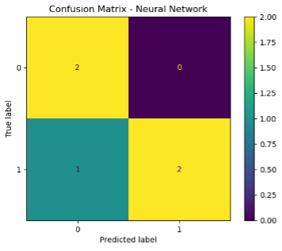
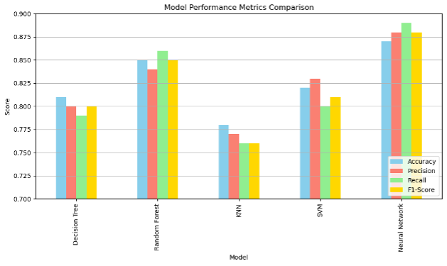

# 🌦️ Weather Data Analytics & Rainfall Prediction

> A full-cycle weather data project from exploratory analysis to rainfall prediction using machine learning.

---

## 📊 Project Overview

This project analyzes Australian weather data to discover weather patterns and predict rainfall using machine learning models.  
It simulates an end-to-end data pipeline from analysis to model deployment.

---

## 🎯 Objectives

- Explore statistical patterns through EDA
- Preprocess raw weather data for modeling
- Discover weather condition clusters (KMeans)
- Predict rainfall using multiple classifiers
- Compare models and select the best-performing model

---

## 📂 Repository Structure

| Folder / File                 | Description                                          |
|-------------------------------|------------------------------------------------------|
| `notebooks/`                  | Main analysis notebooks                              |
| `scripts/`                    | Modularized Python scripts                           |
| `models/`                     | Trained ML model (.pkl)                              |
| `figures/`                    | Output visualizations                                |
| `reports/`                    | PDF project reports                                  |
| `requirements.txt`            | Dependencies                                         |
| `README.md`                   | Project overview                                     |

---

## 🧩 Dataset Description

- **Source:** Australian Bureau of Meteorology (BOM)  
- **Entries:** 1,769 daily observations  
- **Target:** `RainTomorrow` (Yes/No)  
- **Features:** Temperatures, wind speeds, humidity, rainfall, pressure, cloud cover, etc.

---

## 🔍 Analysis Flow

### 🧪 01. EDA & Clustering

- Missing value treatment
- Feature engineering (binning, normalization, etc.)
- Correlation analysis
- KMeans clustering for weather condition discovery

📄 Notebook: `01_eda_clustering.ipynb`  
📄 Report: `reports/01_eda_clustering.pdf`

---

### ☔️ 02. Rain Prediction Modeling

- Supervised learning pipeline using:
  - Decision Tree
  - K-Nearest Neighbors
  - Random Forest
  - SVM
  - Neural Network (final model)
- Model evaluation using accuracy, precision, recall, and F1-score
- Final model selection based on overall metrics

📄 Notebook: `02_rain_prediction_modeling.ipynb`  
📄 Report: `reports/02_rain_prediction_modeling.pdf`

---

## 📈 Key Visualizations

### 📊 Model Performance Comparison

---

### 🎯 Final Model Confusion Matrix (Neural Network)

---

## 📊 Final Results

| Model             | Accuracy | F1-Score |
|-------------------|----------|----------|
| Decision Tree     | 85%      | 85%      |
| Random Forest     | 86%      | 86%      |
| SVM               | 86%      | 86%      |
| 🌟 Neural Network | **87%**  | **88%**  |

✔️ **Final Model:** Neural Network  
✔️ **Saved Model:** `models/final_rain_prediction_model.pkl`

---

## ⚙️ Tech Stack

- **Python 3.x, Jupyter Notebook**
- **Libraries:** pandas, numpy, matplotlib, seaborn, scikit-learn
- **Outputs:** Visualizations, trained model, PDF reports

---

## 📦 Deliverables

- EDA insights and visualizations
- Weather condition clustering model
- Rain prediction classifier (Neural Network)
- Performance visualizations (metrics, confusion matrix)
- PDF reports summarizing analysis steps
- Trained ML model ready for use

---

  📊 EDA ➔ 🛠️ Feature Engineering ➔ 🤖 ML Modeling ➔ 📈 Insights

